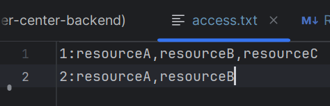
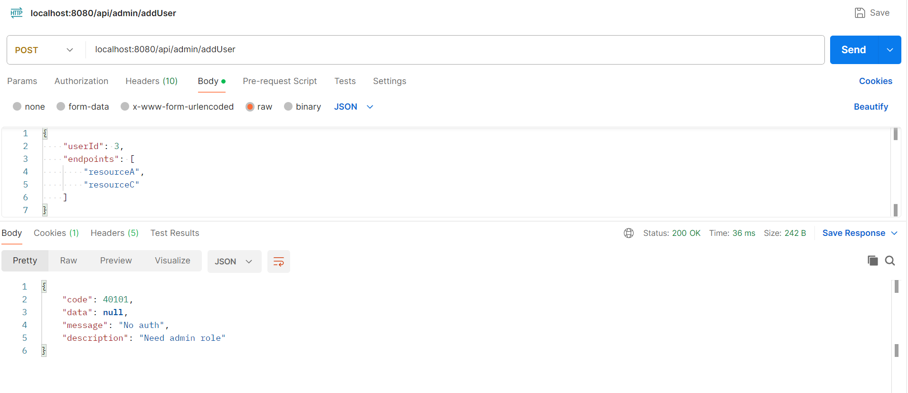
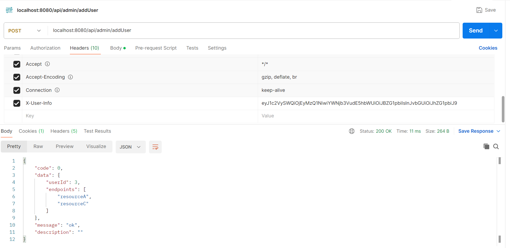
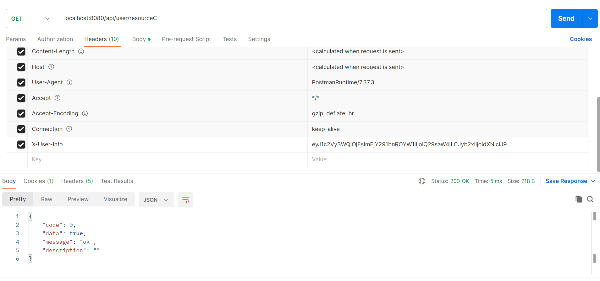
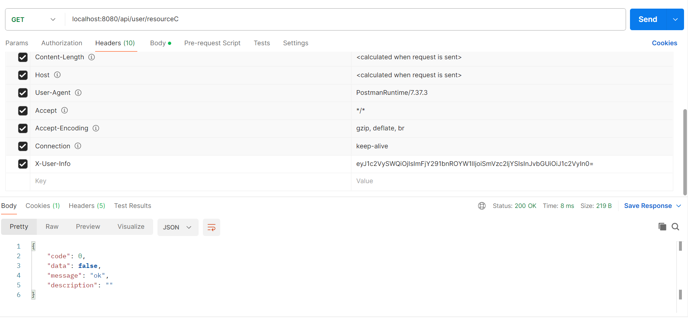

# user-center-backend
## high-level outline
### 1. Role Filter
Create a Filter that intercepts incoming requests, decodes the Base64 header, and sets the user information in the request attributes.

    protected void doFilterInternal(HttpServletRequest request, HttpServletResponse response, FilterChain filterChain)
            throws ServletException, IOException {
        String base64Header = request.getHeader("X-User-Info");
        if (StringUtils.isNotBlank(base64Header)) {
            byte[] decodedBytes = Base64.getDecoder().decode(base64Header);
            String decodedHeader = new String(decodedBytes, StandardCharsets.UTF_8);
            UserInfo userInfo = new ObjectMapper().readValue(decodedHeader, UserInfo.class);
            log.info("the current user is {} of {} role", userInfo.getAccountName(), userInfo.getRole());
            // Set user info in request attributes for later use
            request.setAttribute("userInfo", userInfo);
        }
        filterChain.doFilter(request, response);
    }

### 2.Controllers
Create controllers for admin and user endpoints. Controller can access the userInfo object from the request attributes

    @PostMapping("/addUser")
    public BaseResponse<AccessInfo> addUserAccess(@RequestBody AccessInfo accessInfo, HttpServletRequest request) {
        UserInfo userInfo = (UserInfo) request.getAttribute("userInfo");
        if (!"admin".equals(userInfo.getRole())) {
            throw new BusinessException(ErrorCode.NO_AUTH, "Need admin role");
        }
        //simple validation
        if (Objects.isNull(accessInfo)) {
            throw new BusinessException(ErrorCode.PARAMS_ERROR);
        }
        userService.upsertAccessInfo(accessInfo);
        return ResultUtils.success(accessInfo);
    }

    @GetMapping("/{resource}")
    public BaseResponse<Boolean> checkUserAccess(@PathVariable String resource, HttpServletRequest request) {
        UserInfo userInfo = (UserInfo) request.getAttribute("userInfo");
        long userId = userInfo.getUserId();
        AccessInfo accessInfo = userService.findAccessInfoById(userId);
        boolean isAccess = Objects.nonNull(accessInfo) && accessInfo.getEndpoints().contains(resource);
        return ResultUtils.success(isAccess);
    }
### 3.Services
Implement business logic.
    
    public interface UserService {

        void upsertAccessInfo(AccessInfo accessInfo);

        AccessInfo findAccessInfoById(long id);
    }

### 4. Global Exception Handling
Global Exception Handling.
Customize BusinessException and error codes, handle exceptions globally and return consistent error responses.

### 5. Unit tests

## Test evidence
### PreCondition
user 1：eyJ1c2VySWQiOjEsImFjY291bnROYW1lIjoiQ29saW4iLCJyb2xlIjoidXNlciJ9

user 2：eyJ1c2VySWQiOjIsImFjY291bnROYW1lIjoiSmVzc2ljYSIsInJvbGUiOiJ1c2VyIn0=

admin：eyJ1c2VySWQiOjEyMzQ1NiwiYWNjb3VudE5hbWUiOiJBZG1pbiIsInJvbGUiOiJhZG1pbiJ9

user 1 is granted to resource ABC

user 2 is granted to resource AB
 

### Result
#### scenario 1:  Non-admin account add user

#### scenario 2:  admin account add user

#### scenario 3:  user 1 try to access Resource C

#### scenario 4:  user 2 try to access Resource C

    
